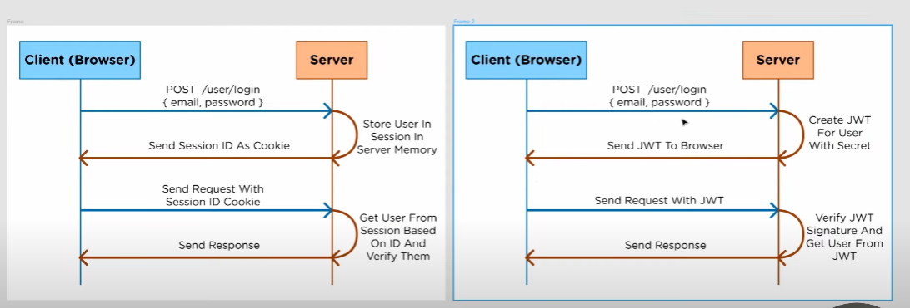

# jwt is authorization, not authentication

## authentication

- passportJS, etc.
- take username and password and check they are correct

## authorization

- sessions cookies, JWT, etc.
- make sure the user that send the request is the same one that logged in/have permission
- i.e. not get hack or corrupt in the middle of traffic

## Difference between session id/cookies and JWT

### Session cookies

- store session in server
- need to perform database lookup from session id to verify the user
- smaller data size (since its just the id)
- multiple servers: since session data is stored server-side, the servers either need to have duplicate data to verify or user need to login again when accessing different servers.

### JWT

- jwt data stored in client
- all data are serialized with a secret key as a jwt by the server
- to verify the data, server just need to use the secret key it sign the data with to check
- don't need to do database lookup since the data is can be verified with the secret key
- larger data size (since its also include other data)
- multiple servers: because the session data is stored client side and the server just need to use secret key to verify it, user don't need to login again

# How jwt works

- user log in
- server authenticate user i.e. check with database, etc.
- when login successful, server create jwt with user data and signature
- server send jwt to client
- client stores jwt i.e. with local storage, etc.
- Afterward, each subsequent request from client includes the jwt in the header
- server can then use this to validate the request that its not been tampered with
- server can also extracted user data from jwt, so server don't need to lookup database

# JWT are best used when:

- The tokens are short-lived
- The token is only expected to be used once
- The application server still uses sessions
